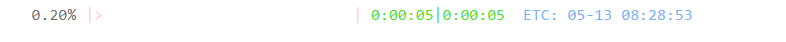
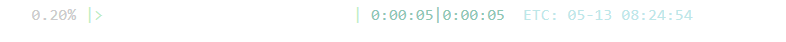
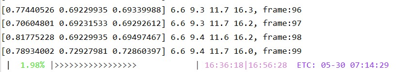

# Pyprobar

[](https://pypi.org/project/pyprobar)
[](https://www.python.org/)
[](LICENSE)
[](https://github.com/beidongjiedeguang)


A beautiful , fast, easy-to-use  progress bar for python.


## Installation

```bash
pip install pyprobar
```

*nightly* version:

```bash
python setup.py install
```


## Synopsis

```bash
28.71% |████████>>>>>>>>>>>>>>>>>  | 0:00:22|0:00:31 ETC: 05-20 18:08:15
```






## Performance

**For 10000000 loops:**

```bash
probar:
100.00%|█████████████████████████████| 0:00:00|0:00:02  ETC: 06-07 12:08:03

bar:
100.00%|█████████████████████████████| 0:00:00|0:00:03  ETC: 06-07 12:11:15

tqdm:
100%|██████████| 10000000/10000000 [00:03<00:00, 2634907.84it/s]

progressbar:
100% (10000000 of 10000000) |############| Elapsed Time: 0:00:46 Time:  0:00:46
```


## Usage

Use `probar` or `bar` for different situations:

`probar`:

  ```python
  from pyprobar import bar, probar
  import time
  
  for idx, x in probar(range(1234), enum=True): 
      time.sleep(0.02)
  ```
  ```bash
  >>> 18.31%|█████>>>>>                  | 0:00:20|0:00:25  ETC: 05-20 19:00:39
  ```
Or  used in  List comprehension:

```python
res = [i for i in probar(range(10))]
print(res)
```

```bash
>>> 100.00%|███████████████████████████| 0:00:00|0:00:00 ETC: 05-20 12:14:33
>>> [0, 1, 2, 3, 4, 5, 6, 7, 8, 9]
```


`bar`:

  ```python
  import numpy as np
  N = 1024
  a = np.linspace(2, 5, N)
  for idx, i in enumerate(a):
      time.sleep(0.01)
      bar(idx, N)
  ```
  ```bash
 >>> 100.00% |███████████████████████████| 0:00:00|0:00:10  ETC: 05-20 20:33:34 
  ```


You can set your own progress bar by using the parameters `symbol_1` and `symbol_2` :

```python
for i in probar(range(1234), symbol_2="o"):
    time.sleep(0.01)
```
```bash
>>> 23.10%|██████ooooooooooooooooooo    | 0:00:10|0:00:14  ETC: 05-20 17:29:57
```

Tip: Search`charmap`  in win10 start menu, you can find a lot of interesting characters.


**Supports progress bars in different colors**:

```python
for idx, i in enumerate(a):
    bar(idx, N, color='1') # `color` options: '1','2','3','4','5','0','update_random'
    time.sleep(0.01)
```


Of course, you can also add text or variables to the progress bar:

```python
for idx, i in enumerate(a):
    text = f"what you want see is {x}"
    bar(idx, N, text=text)
```


multi-line text :

```python
for idx, i in enumerate(a):
    text = f"{v1}, frame:{idx}\n"
    bar(idx, N, text=text)
```




print RGB color string:

```python
from pyprobar.styleString import rgb_str
    text = rgb_str("I'm green!", RGB_fore=[0,255,0])
    print(text)
```


### TODO

- [x] Thread problem in jupyter notebook
- [ ] Speed of information
- [ ] Multithreading


